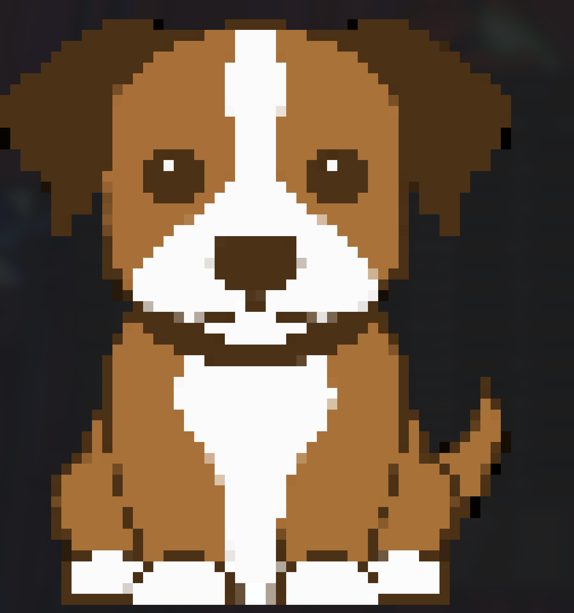

# go-pixels

A Go library for rendering pixel images directly in the terminal using Unicode block characters and ANSI color codes.

<p align="center">

</p>

## Features

- 📸 Load images from file paths
- 🎨 Full color support with ANSI color codes
- ⚫ Grayscale rendering option
- 🔲 Two rendering modes: halfcell and fullcell
- 📏 Flexible width and height scaling
- 🖥️ Cross-platform terminal compatibility

## Installation

```bash
go get github.com/saran13raj/go-pixels
```

## Quick Start

```go
package main

import (
    "fmt"
    "os"
    gopixels "github.com/saran13raj/go-pixels"
)

func main() {
    output, err := gopixels.FromImagePath("image.png", 50, 55, "halfcell", true)

    if err != nil {
        fmt.Fprintf(os.Stderr, "Error: %v\n", err)
        os.Exit(1)
    }
    fmt.Println(output)
}
```

## API Reference

### `FromImagePath(path string, width, height int, renderType string, useColor bool) (string, error)`

Loads an image from the specified file path and converts it to terminal-compatible pixel art.

### `FromImageString(img image.Image, width, height int, renderType string, useColor bool) (string, error)`

Render the pixel art from an image stream with your own decoding.

#### Parameters

- **`path`** (string): Path to the image file (supports common formats like PNG, JPEG, GIF) - for `FromImagePath`
- **`img`** (image.Image): decoded image - for `FromImageStream`
- **`width`** (int): Target width in characters (0 = auto-scale)
- **`height`** (int): Target height in characters (0 = auto-scale)
- **`renderType`** (string): Rendering mode - `"halfcell"` or `"fullcell"`
- **`useColor`** (bool): Enable color rendering (`true`) or grayscale (`false`)

#### Render Types

| Value        | Description                                                         |
| ------------ | ------------------------------------------------------------------- |
| `"halfcell"` | Uses half-height Unicode blocks (▀▄) for higher vertical resolution |
| `"fullcell"` | Uses full-height Unicode blocks (█) for standard resolution         |

#### Returns

- **`string`**: The rendered image as a string ready for terminal output
- **`error`**: Error if image loading or processing fails

## Examples

### Basic Color Rendering

```go
// Render with color and specific dimensions
output, err := gopixels.FromImagePath("photo.jpg", 80, 40, "halfcell", true)
if err != nil {
    log.Fatal(err)
}
fmt.Println(output)
```

### Auto-scaling

```go
// Let the library determine optimal dimensions
output, err := gopixels.FromImagePath("logo.png", 0, 0, "fullcell", true)
```

### Grayscale Rendering

```go
// Render in grayscale for terminals with limited color support
output, err := gopixels.FromImagePath("image.png", 60, 30, "halfcell", false)
```

## [Complete Example] (https://github.com/saran13raj/go-pixels/blob/main/examples/main.go)

```go
package main

import (
    "fmt"
    "os"
    gopixels "github.com/saran13raj/go-pixels"
)

func main() {
    imagePath := "tmp/image.png"

	img, err := loadWebP("tmp/parrot.webp")

    // Example 1: Halfcell rendering with color
    fmt.Println("=== Halfcell Rendering (Color) ===")
	output, err := gopixels.FromImageStream(img, 50, 55, "halfcell", true)
    if err != nil {
        fmt.Fprintf(os.Stderr, "error: %v\n", err)
        os.Exit(1)
    }
    fmt.Println("\n" + output)

    // Example 2: Fullcell rendering with color
    fmt.Println("\n=== Fullcell Rendering (Color) ===")
    output, err = gopixels.FromImagePath(imagePath, 0, 0, "fullcell", true)
    if err != nil {
        fmt.Fprintf(os.Stderr, "error: %v\n", err)
        os.Exit(1)
    }
    fmt.Println("\n" + output)

    // Example 3: Halfcell rendering with grayscale
    fmt.Println("=== Halfcell Rendering (Grayscale) ===")
    output, err = gopixels.FromImagePath(imagePath, 0, 0, "halfcell", false)
    if err != nil {
        fmt.Fprintf(os.Stderr, "error: %v\n", err)
        os.Exit(1)
    }
    fmt.Println("\n" + output)

    // Example 4: Fullcell rendering with grayscale
    fmt.Println("\n=== Fullcell Rendering (Grayscale) ===")
    output, err = gopixels.FromImageStream(imagePath, 70, 75, "fullcell", false)
    if err != nil {
        fmt.Fprintf(os.Stderr, "error: %v\n", err)
        os.Exit(1)
    }
    fmt.Println("\n" + output)
}
```

## Tips

- **Halfcell mode** provides better vertical resolution by using Unicode half-block characters
- **Fullcell mode** uses standard block characters and works better on some terminals
- Use **width and height of 0** to let the library auto-scale the image
- **Color mode** requires a terminal that supports ANSI color codes
- **Grayscale mode** works on any terminal and uses various Unicode characters for different brightness levels

## Requirements

- Go 1.13 or higher
- Terminal with Unicode support
- For color mode: Terminal with ANSI color code support

## License

This project is open source. Please check the repository for license information.

## Contributing

Contributions are welcome! Please feel free to submit issues and pull requests on the [GitHub repository](https://github.com/saran13raj/go-pixels).
